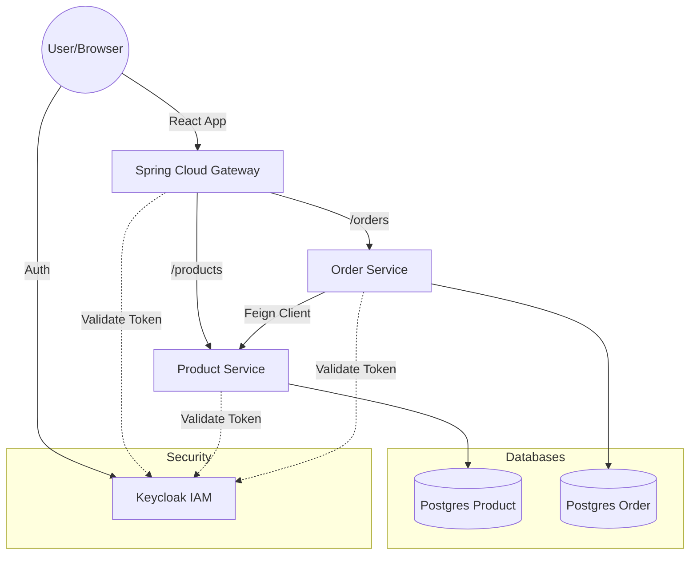

# Secure Microservices Application with Spring Boot, React, & Keycloak

## 📌 Project Overview
This project demonstrates a robust **Secure Microservices Architecture** using **Spring Boot 3**, **Spring Cloud**, and **React**, secured by **Keycloak** (OAuth2/OIDC). It implements best practices for security, inter-service communication, and DevSecOps automation.

The system allows users to view products and place orders. It features a distinction between `USER` and `ADMIN` roles, where Admins can manage the product catalog.

## 🏗️ Architecture
The application follows a microservices architecture pattern:



### 🔹 Services
| Service | Technology | Port | Description |
| :--- | :--- | :--- | :--- |
| **Gateway Service** | Spring Cloud Gateway | `8085` | Entry point, routing, and load balancing. |
| **Product Service** | Spring Boot, JPA | `8081` | Manages product catalog. Protected by RBAC. |
| **Order Service** | Spring Boot, JPA | `8082` | Manages orders. Communicates with Product Service via OpenFeign. |
| **Frontend** | React, Bootstrap 5 | `3000` | User Interface. Handles Auth Code Flow with PKCE. |
| **Keycloak** | Keycloak 23 | `8080` | Identity and Access Management (IAM). |
| **PostgreSQL** | Postgres 15 | `5434/5435` | Dedicated databases for each service. |

## 🛡️ Security Implementation
The security model relies on **OAuth2** and **OpenID Connect (OIDC)**.

*   **Realm:** `sdia-realm`
*   **Client ID:** `react-client` (Public), `product-service` (Bearer-only), `order-service` (Bearer-only).
*   **Roles:**
    *   `USER`: Can view products and place orders.
    *   `ADMIN`: Can create, edit, and delete products.
*   **Token Propagation:** The `Order Service` securely passes the JWT token when calling the `Product Service` using a `RequestInterceptor`.

## 🚀 DevSecOps Pipeline
The project includes a comprehensive CI/CD pipeline using **GitHub Actions**:

1.  **Build**: Compiles Java services using Maven.
2.  **SCA (Software Composition Analysis)**: Uses **OWASP Dependency Check** to scan dependencies for known vulnerabilities (CVEs).
3.  **SAST (Static Application Security Testing)**: Integrates with **SonarQube** for code quality and security analysis.
4.  **Container Scanning**: Uses **Trivy** to scan Docker images for OS and library vulnerabilities.

## 🛠️ Setup & Running

### Prerequisites
*   Docker & Docker Compose
*   Java 21 (for local development)
*   Node.js 18 (for local frontend development)

### Quick Start (Docker)
1.  **Clone the repository**:
    ```bash
    git clone https://github.com/your-username/secure-microservices.git
    cd secure-microservices
    ```

2.  **Build and Start Services**:
    This will start all backend services, databases, Keycloak, and the React frontend.
    ```bash
    docker-compose up -d --build
    ```

3.  **Access the Application**:
    *   **Frontend**: [http://localhost:3000](http://localhost:3000)
    *   **Keycloak Console**: [http://localhost:8080](http://localhost:8080) (admin/admin)
    *   **PgAdmin**: [http://localhost:5050](http://localhost:5050)

### 🧪 Testing
*   **Login**:
    *   User: `user1` / `1234` (View & Buy products)
    *   Admin: `admin` / `1234` (Manage products)
*   **Scenario**:
    1.  Login as `admin`.
    2.  Add a new product "Gaming Mouse".
    3.  Logout and login as `user1`.
    4.  Buy the "Gaming Mouse".
    5.  Check "My Orders" to see the confirmed order.

## 📂 Project Structure
```
├── gateway/                # Spring Cloud Gateway
├── order-service/          # Order Microservice
├── product-service/        # Product Microservice
├── react-app/              # React Frontend
├── docker-compose.yml      # Container orchestration
├── keycloak-realm-export.json # Realm configuration
└── .github/workflows/      # CI/CD Pipeline
```

## 📜 License
This project is for educational purposes.